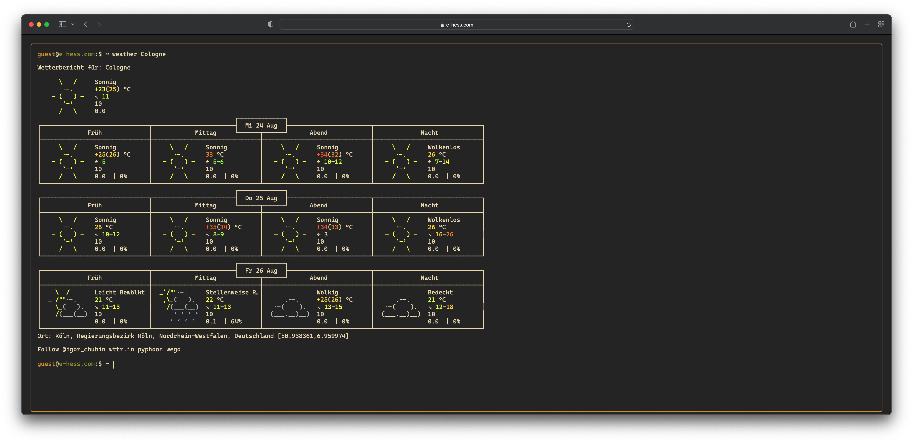

# A simple terminal styled website



[Example (https://e-hess.com)](https://e-hess.com)

## Quick Start

### Using docker

```bash
docker run -it --rm -p 8080:80 ghcr.io/eric-hess/terminal-website:0.3.1
```

If you want to use your own configuration (so you can replace e.g. the contact informations or disable some commands), make sure you mount a own version of the `config.json` in the container.

```bash
docker run -it --rm -p 8080:80 -v $PWD/config.json:/opt/terminal/config.json ghcr.io/eric-hess/terminal-website:0.3.1
```

### Using npm

1. Install dependencies:

```bash
npm install
```

2. Run the dev server:

```bash
npm run start
```

## Configuration

This is the default `config.json` file. Feel free to customize it for your needs.

```json
{
    "title": "e-hess.com",
    "prompt": {
        "username": "guest"
    },
    "commands": {
        "about": {
            "enabled": true,
            "help": "displays some informations about root",
            "value": "I am Eric, a full-stack software developer."
        },
        "apod": {
            "enabled": true,
            "help": "displays the NASA astronomy picture of the day",
            "title": "Title",
            "description": "Description"
        },
        "contact": {
            "enabled": true,
            "help": "displays some contact information about root",
            "email": "terminal@e-hess.com"
        },
        "date": {
            "enabled": true,
            "help": "displays the current date and time"
        },
        "echo": {
            "enabled": true,
            "help": "write arguments to the standard output"
        },
        "github": {
            "enabled": true,
            "help": "displays the GitHub profile link of root",
            "value": "eric-hess"
        },
        "help": {
            "enabled": true,
            "help": "displays all available commands"
        },
        "location": {
            "enabled": true,
            "help": "displays the current location information by clients ip address",
            "ip": "IP",
            "provider": "Provider",
            "country": "Country",
            "region": "Region",
            "city": "City"
        },
        "qrcode": {
            "enabled": true,
            "help": "generate a qrcode for a given url e.g. 'qrcode https://google.com/'"
        },
        "uuid": {
            "enabled": true,
            "help": "generate and displays a uuid"
        },
        "weather": {
            "enabled": true,
            "help": "displays the current weather at given location e.g. 'weather Berlin'"
        },
        "whoami": {
            "enabled": true,
            "help": "tells you who you are",
            "value": "I can't tell you who you are, but I can tell you who I am. Try the 'about' command."
        }
    }
}
```